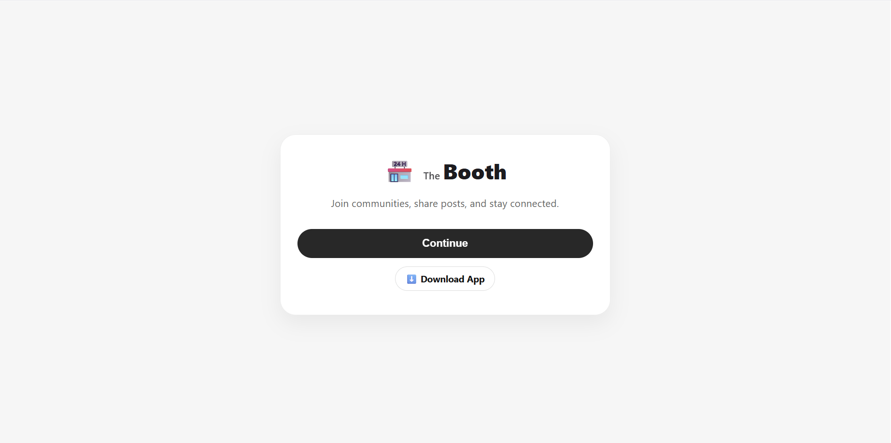
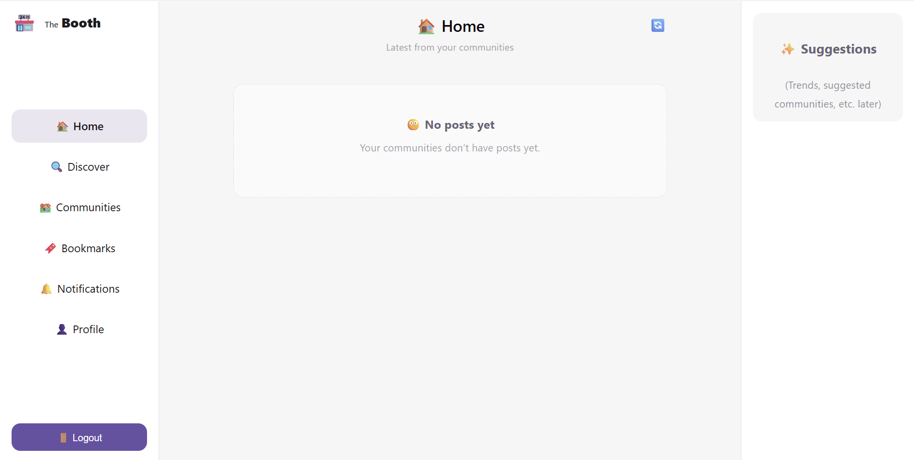
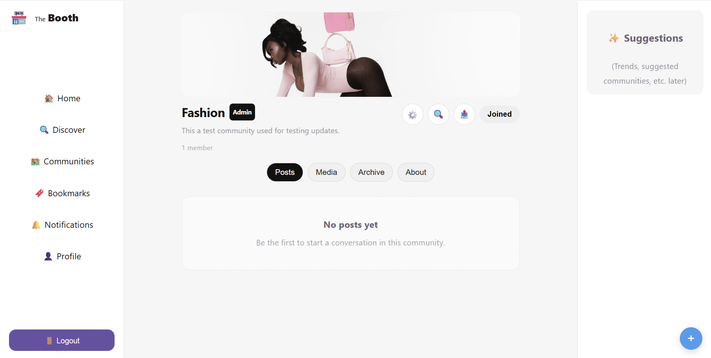
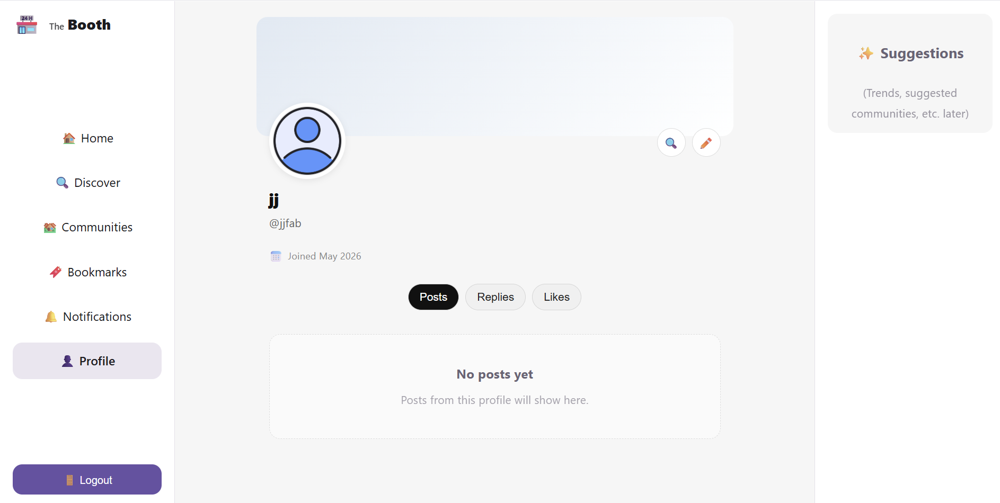
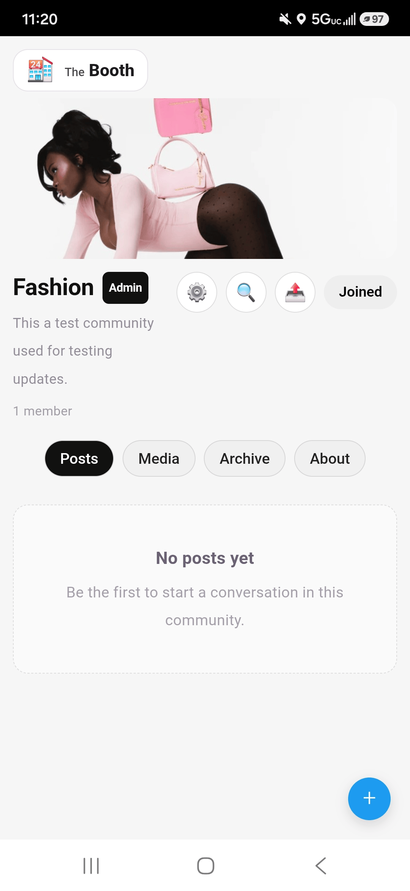

# The Booth

A Twitter-style communities social platform built with React, Supabase, and Vite PWA.

## Features

- Community-based social posting
- Twitter-style feed experience
- User profiles and avatars
- Community moderation tools
- Likes, bookmarks, and comments
- Transferable community ownership
- Account deletion with full cleanup
- Installable PWA for mobile and desktop

## Tech Stack

- React
- Vite
- Supabase
- Vercel
- Cloudflare
- Progressive Web App (PWA)

## Live App

https://jointhebooth.com

---

# Preview

## Landing Page



## Home Feed



## Community Page



## Profile Page



---

# Installable Mobile App (PWA)

The Booth can be installed directly to your phone home screen and used like a native app on Android, iPhone, iPad, and desktop.



---

# Demo Video

https://github.com/user-attachments/assets/d54b0039-433b-416f-b49c-5036ab340a1d

---

# Development

```bash
npm install
npm run dev
```

# Production Build

```bash
npm run build
```

# License

MIT
